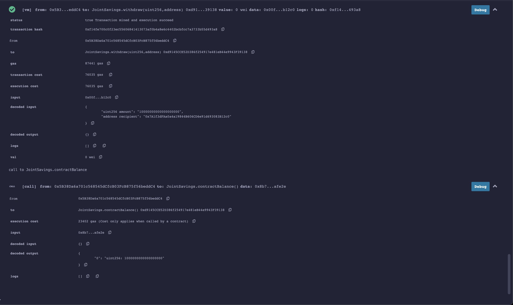

# Challenge-20

Joint Savings is a **Solidity** smart contract for automating the creation of joint savings accounts. It will accept two user addresses and use **ether** management functions to provide the *deposit* and *withdraw* features for the account. 

---
## Technologies
Joint Savings uses:
### **[Remix IDE](remix.ethereum.org)** - a platform for developing, deploying and administering smart contracts for Ethereum like blockchains.
### **[Solidity](https://soliditylang.org/)** - an ethereum programming language for writing smart contracts.
```Solidity
pragma solidity ^0.5.0;
```
---
## Installation Guide
First, install **[Metamask](metamask.io)**. Create a new account using the 12-word mnenomnic phrase from your **[Ganache](https://trufflesuite.com/ganache)** environment. Make sure the last four digits of the **RPC Server** on Ganache is the same as the **localhost** number on the network you are connected to on your Metamask. In Remix IDE, make sure to compile the joint_savings.sol file using the **0.5.0+commit.1d4f565a** compiler. Deploy the smart contract on the **Deploy & run transactions** tab. Your deployed smart contract should show up under **Deployed Contracts**. Metamask should pop up--follow the prompts to connect the smart contract with your Metamask. Back in Remix IDE, click the dropdown arrow to access the functionalities of joint_savings.sol. 

---
## Usage
Under **setAccounts** enter the two accounts you'd like to connect to this smart contract:

Test the deposit functionality by sending 1 ether as wei, using the **contractBalance** function to verify the funds were added to the contract:

Send 10 eth as wei:

Send 5 eth as wei:


Test the withdrawal functionality by withdrawing 5 eth into **accountOne**, followed by the **contractBalance** function to verify it was added to the contract:

Then use the **lastToWithdraw** and **lastWithdrawAmount** functions to verify that the amount and address were correct:

Do the same for **accountTwo** except this time withdraw 10 eth:

Verify the amount and address are correct:


---
## Contributors
Heeje Yoo - [Email](heeje90@pm.me)

---
## License
Copyright 2022 Heeje Yoo

Permission is hereby granted, free of charge, to any person obtaining a copy of this software and associated documentation files (the "Software"), to deal in the Software without restriction, including without limitation the rights to use, copy, modify, merge, publish, distribute, sublicense, and/or sell copies of the Software, and to permit persons to whom the Software is furnished to do so, subject to the following conditions:

The above copyright notice and this permission notice shall be included in all copies or substantial portions of the Software.

THE SOFTWARE IS PROVIDED "AS IS", WITHOUT WARRANTY OF ANY KIND, EXPRESS OR IMPLIED, INCLUDING BUT NOT LIMITED TO THE WARRANTIES OF MERCHANTABILITY, FITNESS FOR A PARTICULAR PURPOSE AND NONINFRINGEMENT. IN NO EVENT SHALL THE AUTHORS OR COPYRIGHT HOLDERS BE LIABLE FOR ANY CLAIM, DAMAGES OR OTHER LIABILITY, WHETHER IN AN ACTION OF CONTRACT, TORT OR OTHERWISE, ARISING FROM, OUT OF OR IN CONNECTION WITH THE SOFTWARE OR THE USE OR OTHER DEALINGS IN THE SOFTWARE.